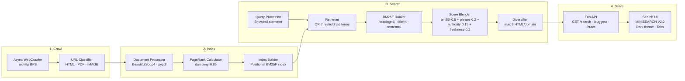

# MINISEARCH — Search Engine From Scratch

Classical BM25F + PageRank search engine built from scratch in Python. Supports HTML, PDF, and image retrieval with positional indexing, domain authority, result diversification, and a dark-themed search UI.

No embeddings. No vector search. No external search APIs.

---

## Architecture Diagram



Full architecture: [docs/v2-architecture.md](docs/v2-architecture.md)

---

## Versions

| Version | Branch | Description |
|---------|--------|-------------|
| V1 | `main` | BM25 ranking, HTML crawl, SQLite storage |
| V2 | `v2` | BM25F + PageRank, PDF + image support, Snowball stemmer, heading field, domain authority, diversification, evaluation suite |

---

## V2 Quick Start

```bash
# Install dependencies
pip install -r search_engine/requirements.txt

# Run full pipeline (clean + crawl mock site + index)
python search_engine/tools/run_pipeline.py

# Start API server (from search_engine/)
cd search_engine && uvicorn api.app:app --reload

# Open http://localhost:8000 in browser
```

### Manual pipeline steps

```bash
# 1. Crawl a site
cd search_engine
python crawler/run_crawler.py

# 2. Process crawled documents into DB
python process_documents.py

# 3. Calculate PageRank
python -c "from search.pagerank import PageRankCalculator; p=PageRankCalculator(); p.calculate_and_save()"

# 4. Build search index
python -c "from indexing.index_builder import IndexBuilder; b=IndexBuilder(); b.build(); b.save(); b.close()"
```

---

## API Endpoints

| Method | Endpoint | Description |
|--------|----------|-------------|
| GET | `/search?q=asyncio&limit=10` | Main search (web + PDF + images) |
| GET | `/search/images?q=diagram&limit=10` | Image-only search |
| GET | `/suggest?q=py` | Query autocomplete |
| GET | `/crawl?url=https://example.com&max_pages=100` | Trigger synchronous crawl + index |
| GET | `/crawl?q=python+asyncio&max_pages=30` | Discover seeds then crawl |
| GET | `/health` | Liveness check |
| GET | `/` | Search UI |

---

## Scoring Weights

```
DOC_SCORE_WEIGHTS = {
    bm25f:       0.50,   # BM25F across heading/title/content/url/author
    phrase_prox: 0.20,   # Phrase match + distance-decay proximity
    authority:   0.15,   # 60% doc PageRank + 40% domain mean PageRank
    freshness:   0.10,   # exp(-days_old / 365)
    url_match:   0.05,   # query terms in URL path
}

BM25F Field Weights:
    heading: 6.0   (H1/H2 — strongest signal)
    title:   4.0
    url:     2.0
    author:  2.0
    content: 1.0
```

---

## Running Tests

```bash
cd search_engine

# Unit tests — ranking logic with synthetic documents
python -m pytest tests/ranking_tests.py -v          # 16/16 pass

# Core integration tests
python -m pytest tests/test_v2_0_core.py -v

# Full quality benchmark (requires API running on :8000)
python tests/run_search_quality.py --gold
```

---

## Storage Layout

```
data/
├── search.db          # SQLite: documents, images, links, query_logs, query_cache
├── raw_html/          # Crawled HTML + metadata.json
└── index/
    ├── postings.json           # Positional inverted index
    ├── doc_stats.json
    ├── corpus_stats.json
    ├── image_postings.json
    └── image_corpus_stats.json
storage/
├── pdfs/              # Downloaded PDF binaries
└── images/            # Images (SHA256-named, deduped)
search_engine/
├── api/app.py         # FastAPI server + search UI
├── crawler/           # Async BFS crawler
├── indexing/          # Index builder + Snowball tokenizer
├── parser/            # HTML parser (title, H1/H2, meta desc, images)
├── process_documents.py
├── search/            # BM25F ranker, retriever, PageRank, query understanding
├── storage/           # SQLite database + schema
└── tests/             # Unit tests + quality benchmark
```

---

## Background Research

- [A search engine in CSS](https://stories.algolia.com/a-search-engine-in-css-b5ec4e902e97)
- [Building a search engine using Redis and redis-py](https://www.dr-josiah.com/2010/07/building-search-engine-using-redis-and.html)
- [Building a Vector Space Indexing Engine in Python](https://boyter.org/2010/08/build-vector-space-search-engine-python/)
- [Building A Python-Based Search Engine (video)](https://www.youtube.com/watch?v=cY7pE7vX6MU)
- [Making text search learn from feedback](https://medium.com/filament-ai/making-text-search-learn-from-feedback-4fe210fd87b0)
- [Finding Important Words in Text Using TF-IDF](https://stevenloria.com/tf-idf/)
