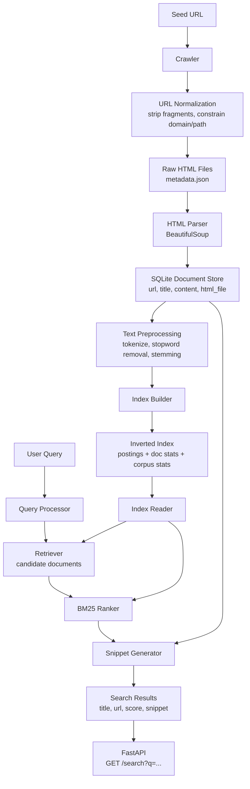

# Search Engine V1 Architecture

## V1 Scope

- Crawl and normalize web pages.
- Parse HTML into title and searchable text.
- Store documents in SQLite.
- Build an inverted index with corpus and document statistics.
- Retrieve candidates from query terms.
- Rank candidates with BM25.
- Generate snippets for search results.
- Serve results through `GET /search?q=python`.

## Deferred To V2

- Positional index.
- Exact phrase search.
- Field weighting with BM25F.
- Link graph and PageRank.
- Incremental indexing.

## Deferred To V3

- Dense embeddings.
- Hybrid lexical/vector retrieval.
- Cross-encoder re-ranking.
