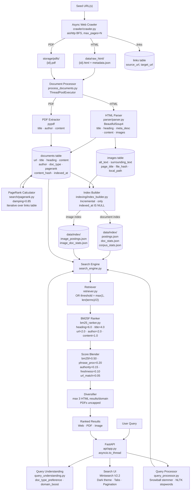
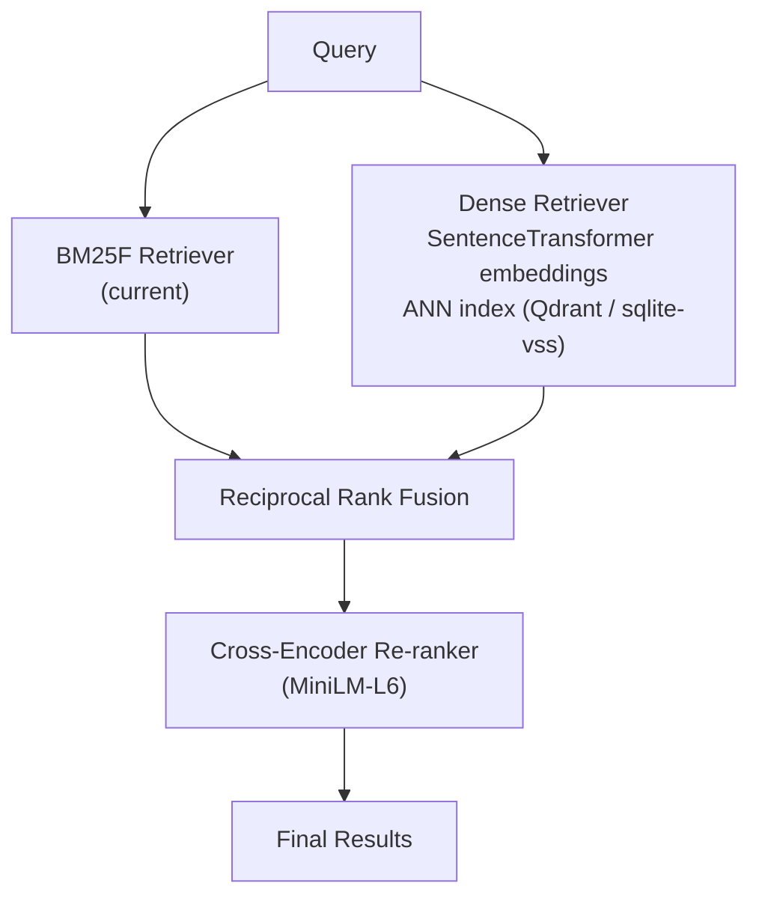

# MINISEARCH V2 — Architecture & Design

## System Overview

MINISEARCH V2 is a classical BM25F + PageRank search engine supporting HTML, PDF, and image retrieval. No embeddings, no vector search. Pure lexical retrieval with positional indexing, domain authority, and result diversification.

## Pipeline Architecture



---

## Component Details

### 1. Crawler (`crawler/`)
- **Async BFS** using `aiohttp` with configurable concurrency (`limit=10`)
- Classifies URLs: `HTML | PDF | IMAGE | VIDEO | AUDIO`
- Saves HTML to `data/raw_html/`, PDFs to `storage/pdfs/`
- Inserts `(source_url, target_url)` pairs into `links` table for PageRank
- `restrict_domain=True` by default; seed path prefix enforced

### 2. Document Processor (`process_documents.py`)
- `ThreadPoolExecutor(max_workers=10)` for parallel processing
- HTML: BeautifulSoup4 extracts `title`, `heading` (H1/H2), `meta_description`, `content`, `images`
- PDF: `pypdf` extracts text + `/Author` + `/Title` metadata
- Meta description prepended to content for better snippet quality
- SHA-256 `content_hash` for change detection (skip unchanged docs)
- Image download with dedup: skip files < 2 KB and common icon patterns

### 3. PageRank (`search/pagerank.py`)
- Iterative PageRank with `damping=0.85`
- Converges when max delta < 1e-6 (typically ~10–15 iterations)
- Scores written back to `documents.pagerank`
- **Must run after crawling, before indexing**

### 4. Index Builder (`indexing/index_builder.py`)
- **Positional inverted index**: `{term → {doc_id → {field → [positions]}}}`
- Fields indexed (documents): `heading`, `title`, `content`, `url`, `author`
- Fields indexed (images): `alt_text`, `surrounding_text`, `page_title`, `image_url`, `filename`
- **Incremental mode** (default): only re-indexes docs where `indexed_at IS NULL` or `indexed_at < crawled_at`
- Outputs JSON to `data/index/`: `postings.json`, `doc_stats.json`, `corpus_stats.json` (+ image variants)
- `corpus_stats.json` includes `avg_heading_length` for BM25F length normalization

### 5. Tokenizer (`indexing/tokenizer.py`)
- Unicode NFKC normalization → lowercase → tokenize `[a-z0-9]+`
- NLTK English stopword removal
- **Snowball stemmer** (Porter2 algorithm) — better morphological reduction than Porter

### 6. Search Engine (`search/search_engine.py`)

#### Query Understanding
```python
_PDF_KEYWORDS  = {"pdf", "paper", "research", "survey", "thesis", "notes",
                  "guide", "handbook", "tutorial", "textbook", "lecture", ...}
_IMAGE_KEYWORDS = {"image", "photo", "logo", "diagram", "picture", "screenshot", "figure"}
_DOMAIN_HINTS  = {"github": "github.com", "arxiv": "arxiv.org", "wikipedia": "wikipedia.org", ...}
```

#### Retrieval
- OR threshold: `max(1, len(query_terms) // 2)` for 3+ term queries
- Fallback to threshold=1 if strict threshold yields 0 candidates

#### BM25F Scoring
```
BM25F(q, d) = Σ_t IDF(t) * tf_weighted(t, d)

tf_weighted(t, d) = Σ_f weight_f * (tf_{t,f} / len_norm_f)
                                                              
len_norm_f = (1 - b_f) + b_f * (|d_f| / avg|d_f|)

IDF(t) = log((N - df + 0.5) / (df + 0.5) + 1)
```

| Field   | Weight | b (length norm) |
|---------|--------|-----------------|
| heading | 6.0    | 0.30            |
| title   | 4.0    | 0.50            |
| url     | 2.0    | 0.50            |
| author  | 2.0    | 0.50            |
| content | 1.0    | 0.75            |

#### Score Blending
```
final_score = 0.50 * bm25f_norm
            + 0.20 * phrase_prox_norm
            + 0.15 * authority_norm
            + 0.10 * freshness
            + 0.05 * url_match
```

- **authority**: `log1p((0.6 * doc_pagerank + 0.4 * domain_mean_pagerank) * 100)`
- **freshness**: `exp(-days_old / 365)`
- **url_match**: fraction of query terms in URL path tokens

#### Intent Boosts
- PDF doc_type match: score × **1.5**
- Domain boost match: score × **1.5**

#### Result Diversification
- HTML results: max **3 per domain** (greedy pass)
- PDF results: uncapped (rare, don't penalise)
- Re-merged by score before return

#### Image Ranking
```
img_score = 0.60 * bm25f_norm + 0.30 * phrase_prox_norm + 0.10 * authority
```
Icon/favicon penalty: `× 0.4` on URLs matching `favicon|/icons?[/_-]|sprite|badge|...`

Image BM25F field weights:
| Field            | Weight |
|------------------|--------|
| filename         | 3.0    |
| alt_text         | 4.0    |
| page_title       | 2.0    |
| surrounding_text | 1.5    |
| image_url        | 1.0    |

### 7. API (`api/app.py`)
- FastAPI with `asyncio.to_thread` for all blocking search calls
- `GET /search?q=...` → returns `{web, pdfs, images, query_time_ms}`
- `GET /search/images?q=...` → image-only search
- `GET /suggest?q=...` → query autocomplete from `query_logs`
- `GET /crawl?url=...` → trigger synchronous crawl + index
- `GET /health` → liveness check
- `GET /` → dark-themed search UI (tabs: All / Web / PDFs / Images)
- Query response cache in `query_cache` table (24h TTL)
- Background fallback: when 0 local results → discovers seeds via Wikipedia → DuckDuckGo → Bing, crawls, re-indexes

---

## Storage Layout

```
Search_Engine_From_Scratch/
├── data/
│   ├── search.db          # SQLite: documents, images, links, query_logs, query_cache
│   ├── raw_html/          # Crawled HTML files + metadata.json
│   └── index/
│       ├── postings.json           # term → doc_id → field → [positions]
│       ├── doc_stats.json          # doc_id → {title_length, content_length, heading_length, ...}
│       ├── corpus_stats.json       # num_docs, avg_*_length, num_terms
│       ├── image_postings.json
│       ├── image_doc_stats.json
│       └── image_corpus_stats.json
├── storage/
│   ├── pdfs/              # Downloaded PDF binaries
│   └── images/            # Downloaded image binaries (SHA256-named)
└── search_engine/
    ├── api/app.py
    ├── crawler/
    ├── indexing/
    ├── parser/
    ├── process_documents.py
    ├── search/
    ├── storage/
    └── tests/
```

### SQLite Schema

```sql
documents(id, url, title, content, author, doc_type, html_file,
          content_hash, heading, crawled_at, indexed_at, pagerank)

images(id, page_url, image_url, alt_text, surrounding_text, page_title,
       width, height, file_hash, file_size, local_path, downloaded_at,
       crawled_at, indexed_at)

links(id, source_url, target_url)          -- PageRank graph
query_logs(id, query, result_count, timestamp)
query_cache(query, response_json, created_at)
```

> **Thread safety:** `Database` uses `RLock` on all writes. API uses `asyncio.to_thread` for every search call.

---

## V2.2 Quality Improvements (vs V2.0)

| # | Change | Impact |
|---|--------|--------|
| 1 | Snowball stemmer replaces Porter | Better recall on morphological variants |
| 2 | H1/H2 heading field, weight=6.0 | Page structure = stronger ranking signal |
| 3 | Meta description extracted + prepended to content | Richer snippets |
| 4 | Coverage boost **removed** | Was inflating docs matching all terms regardless of relevance |
| 5 | OR threshold raised: `max(1, len(terms)//2)` for 3+ queries | Better precision, fewer junk candidates |
| 6 | Domain authority: 60% doc PageRank + 40% domain mean | Cross-doc authority signal |
| 7 | PDF intent boost 1.3× → **1.5×** | PDFs surface higher for PDF-intent queries |
| 8 | Image icon penalty 0.4× | Favicons/sprites deprioritised |
| 9 | Result diversification (max 3 HTML/domain) | No single site dominates SERP |

---

## V3 Planned (Design-Only Placeholders)



See `search/future_design_placeholders.py` for stub implementations.
